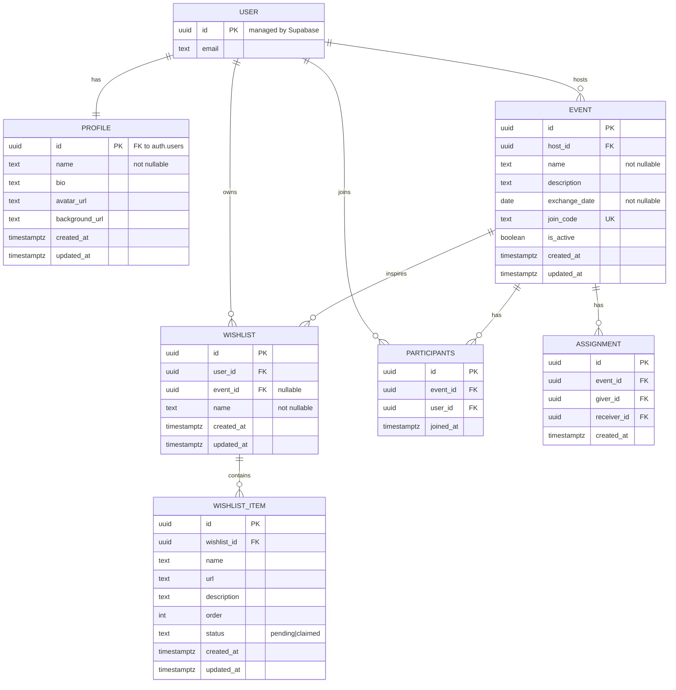

# Schema v0.2.0

## User table (managed by Supabase Auth)

Managed by Supabase - do not alter in migrations
Fields: id (PK), email, etc.

## Profiles table

One-to-one relationship with auth.users (each user has one profile)
Fields: id (PK, FK to auth.users), name (not nullable), bio, avatar_url, background_url

## Events table

Many-to-one with USER (host)
Many-to-many with USER via PARTICIPANTS
Fields: id (PK), host_id (FK), name (not nullable), description, exchange_date (not nullable), join_code (UK), is_active

## Participants table

Join table for USER-EVENT many-to-many
Fields: id (PK), event_id (FK), user_id (FK)

## Wishlists table

Many-to-one with USER (user can have many wishlists)
Many-to-one (optional) with EVENT (wishlist may belong to event)
One-to-many with WISHLIST_ITEM
Fields: id (PK), user_id (FK), event_id (FK, nullable), name (not nullable)

## Wishlist Items table

Many-to-one with WISHLIST
Fields: id (PK), wishlist_id (FK), name, url, description, order, status (pending|claimed)

## Assignments table

Secret Santa pairings, scoped to event
Fields: id (PK), event_id (FK), giver_id (FK), receiver_id (FK)

